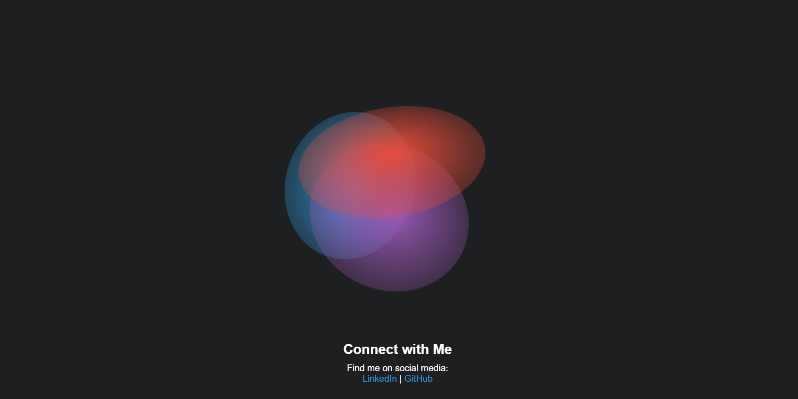

This project showcases a CSS art. It's a visually appealing art piece created using CSS animations and gradients. The art consists of a rotating shape with multiple layers of colors.

## Demo

You can see the live demo of the CSS art [here](https://cssartbysuraj.netlify.app/).

## Preview

## Features

- Utilizes CSS animations to create a rotating effect.
- The shape is created using CSS gradients for a vibrant and dynamic appearance.
- Responsive design ensures optimal viewing experience on different devices.
- Includes a "Connect with Me" section to provide links to social media profiles.

## Usage

To use the CSS art, follow these steps:

1. Clone the repository: `git clone https://github.com/your-repo.git`
2. Open `index.html` in a web browser.
3. Enjoy the CSS art!

## Customize

You can customize the CSS art by modifying the following:

- Colors: Update the colors used in the CSS gradients to change the appearance of the shape.
- Size: Adjust the `width` and `height` of the `.container` class to resize the art.
- Animation: Modify the animation duration and timing functions in the CSS keyframes for different effects.
- Connect with Me: Update the links in the "Connect with Me" section to direct users to your own social media profiles.

## Contributions

Contributions to enhance the CSS art or add new features are welcome. If you find any issues or have suggestions, feel free to open an issue or submit a pull request.

